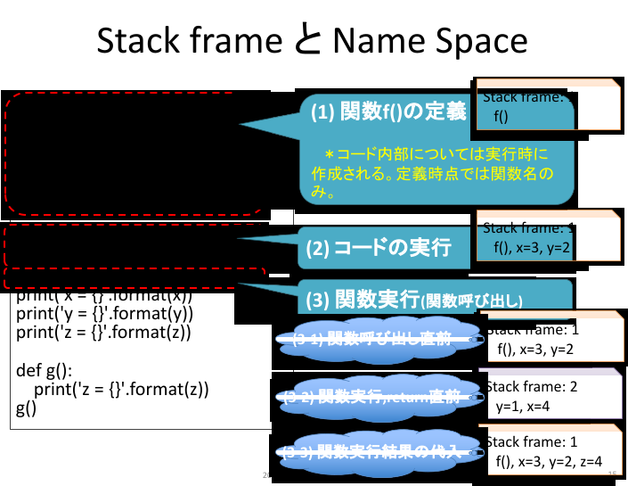

# 関数の補足

## スタックフレーム
### スタックフレームと名前空間


教科書4.1.3節のスコープについて詳細に眺めていこう。

上記コード例を順序よく処理していくと、まずdef文により関数fが定義されている。ここでは定義しているだけのため、実行はせず、スタックフレーム上に関数fを記録しておくだけとなる。これまではメモリ上に関数やメモリを保存するといった説明をしてきたが、より厳密には **スタックフレーム(stack frame)** と呼ぶ。また、便宜上最初のスタックフレームを1と名付けておこう。上図における「(1) 関数f()の定義」がスタックフレーム1である。

関数定義を読み終えると、(2)の2行の命令を実行する。ここでも同様にスタックフレーム1に変数x, y をそれぞれ保存することになる。(1)や(2)のように、今いるスタックフレームに保存している関数名や変数名そしてそれらの中身は、デバッグ実行でも確認することができる。

次のスライド内(3)の命令は関数呼び出しを指定しているため、まず関数の中に移動する。この **「関数呼び出し」をする際には新しいスタックフレームを作成し、そこで呼び出された関数ブロックを処理** しようとする。そのため新しく作成されたスタックフレーム内には、その呼び出し元となるスタックフレーム1とは独立して変数を利用することができる。スライド内の(3-1)〜(3-2)がその様子を示しており、関数呼び出し直前のスタックフレーム1には関数f、変数x、yが登録されており、その状態で関数呼び出されるとスタックフレーム2が作成され、関数ブロックを処理してreturn文を実行する直前においては変数xとyだけが保存されている。また、スタックフレーム1のx,yと、スタックフレーム2のx,yは無関係である点に注意しよう。**スタックフレーム2の中で（関数ブロックを処理している最中で）変数x,yをどのように処理したとしても、スタックフレーム1のx,yには影響を及ぼさない**。

関数呼び出しを実行し終えると、その結果がreturn文で戻されているためその値を変数zに保存する。この際、関数実行が終わった時点でそのスタックフレームは破棄される。

---
### スタック構造と名前空間の参照順序


スタックフレームが構築され、破棄される流れを改めて確認してみよう。上図における(3-1)〜(3-3)は、前の図と対応している。

(3-1)の状態では、スタックフレーム1に関数f、変数x,yが保存されている。このスタックフレーム1は、プログラム実行時に自動で生成されるスタックフレームである。例えば、関数呼び出しが一度もないプログラムを実行した場合には、全ての変数名はスタックフレーム1の中で処理されることになる。

(3-1)から関数呼び出しが行われると、スタックフレーム2が作成される。この時点で、スタックフレーム1の上に新しいスタックフレーム2が積み上げられている点に着目しよう。「フレーム（frame）」を英英辞書で調べると「a rigid structure that surrounds or encloses something such as a door or window.」と述べられており、何かしら囲まれた構造を意味する。**スタック（stack）** は専門用語であり、スライド内右上にあるスタック構造のことを指している。これはどのような構造かというと、本スライドで可視化しているように「箱」が積み重なっている構造のことを指す。下の箱の中身を確認するためには、上の箱をどかす必要がある。別の言い方をすると「**最後に作られたスタックフレームから、参照される**」特性を持つ[データ構造](https://ja.wikipedia.org/wiki/データ構造)のことを「スタック構造」と呼び、**Last-in（最後に入れたもの）, First-out（最初に出される）** という呼び方をする。より詳細は2年次の講義「アルゴリズムとデータ構造」で扱う。

変数の参照範囲を意味するスコープは、このスタックフレームと密接に結びついている。一般的には最上段にある最も新しいスタックフレームを参照する。ただし例外もあり、「もし現在参照しているスタックフレームに存在しない名称（変数・関数・モジュール等）があれば、スタックフレームを遡って参照する」ように動作する。この例を次のコード例で眺めてみよう。

---
### コード例
```python
# スライムのHPが0より大きい間タコ殴りにするゲーム

import random

def encount_enemy():
    hitpoint = random.randint(3, 7)
    return hitpoint

hp = encount_enemy()
print('敵に遭遇した。(敵HP={})!'.format(hp))

while (hp > 0):
    damage = random.randint(2,4)
    hp = hp - damage
    print('敵に{}のダメージ!(敵HP={})'.format(damage,hp))

print('スライムを倒した！')
```

関数encount_enemyの中身を確認してみよう。ここでは random モジュールに登録されている関数 randint を利用している（呼び出している）。しかし、randomモジュールはこの関数の中にはどこにも定義していない。このため encount_enemy 関数が呼び出されて作成されたスタックフレーム内には random モジュールが記録されておらず、利用できない（NameError）になりそうだ。しかしながら、前に述べた通り「もし現在参照しているスタックフレームに存在しない名称（変数・関数・モジュール等）があれば、スタックフレームを遡って参照する」ように動作するため、遡って関数呼び出し前のスタックフレームを参照する。そこには random モジュールが登録されているため、それを利用する。

このように、Pythonにおいてはスタックフレームを遡って参照することを覚えておこう。

---
### スタックフレームのポイント
- トップレベル（インタプリタ起動時、もしくはスクリプトファイル実行時の最初のブロック）では、全ての関数名・変数名をトレースし、最初のスタックフレームに保存する。
- 関数が呼び出されると、新しいスタックフレームが作られる。
  - 関数内での処理は、スコープ外にあるスタックフレームには影響を及ぼさない。（**例外あり**）
  - 関数が終了すると、スタックフレームは廃棄(pop)される。
    - 廃棄しないとメモリに残り続けるため。
  - 現スタックフレームに記録されていない名前が参照されると、「呼び出し元のスタックフレーム」を検索する。この遡り検索をトップレベルまで繰り返しても見つからない場合、NameErrorとなる。
- スタックフレームとスコープに基づく名前空間の参照
  - スコープとスタックフレームを意識しよう。
  - 大原則
    - 関数を呼び出すと新しくスタックフレームが追加される。
    - 関数の処理を終えると、スタックフレームは破棄される。
    - 名前空間は現スタックフレームから遡って検索する。

---
## 参照渡しと値渡し
原則として、関数内での処理はスコープ外にあるスタックフレームには影響を及ぼさない。しかし関数へ引数として渡す変数の型によっては影響を及ぼすことがある。これらは関数引数を **値渡し(call by value)** と **参照渡し(call by reference)** のどちらで渡しているかによって動作が異なる。

参照渡しと値渡しの2種類が用意されている[理由はいろいろある](https://en.wikipedia.org/wiki/Evaluation_strategy)が、例えば要素1万個を保存しているリストを想像してみよう。これを関数に渡して各要素を確認しながら処理させたいとき、関数に渡すときにすべての要素を複製する必要があるのだろうか。これが1万人の顧客名簿データならば複製すること無く同じデータを参照するだけでよいはずだ。これを実現しているのが参照渡しである。

それならば全て参照渡しで良いのではと思うかもしれないが、例えば
```python
def add(value1, value2):
    result = value1 + value2
    value1 = 10
    value2 = 100
    return result

a = 1
b = 2
result = add(a, b)
print(a, b, result)
```
ぐらいのコードで、関数内の操作勝手に外部変数a,bの中身が書き換えられてしまうと困らないだろうか。即ち大前提としては関数内での処理はそこに留めておき（独立性を担保しておき）、必要なものは戻り値として返してやって利用したら良いはずだ。このような独立性を保つための工夫が値渡しである。

値渡しの場合には値を新規複製して利用するように動作するため、関数呼び出し前のオブジェクトには影響を及ぼさない。**参照渡しの場合には同じオブジェクトへの参照を複製して利用するように動作する** ため、関数呼び出し前のオブジェクトと関数内引数のオブジェクトは同じ参照先を共有しているように振る舞い、結果として影響を及ぼす。

- 値渡し（影響なし）
  - **immutable オブジェクトの型**: int, float, str, bool, NoneType, tupleなど。
- 参照渡し（影響あり）
  - **mutable オブジェクトの型**: list, dict, setなど。

参照渡しのコード例を見てみよう。以下のコードを実行すると、変数dataは関数append_oneの中で操作されているが、戻り値としては返していない。にも関わらずdataそのものが変わってしまっていることを確認できるはずだ。
```python
def append_one(target: list) -> None:
    target.append(1)

data = [1, 2, 3, 4]
append_one(data)
print(data)
```

```{note}
- 参考: [値渡しと参照渡しの違いを理解する](https://magazine.rubyist.net/articles/0032/0032-CallByValueAndCallByReference.html)
```

---
## 関数引数のデフォルト値


関数定義における補足として、引数にデフォルト値を設定することができる。繰り返しになるが、デフォルトとは指定しなかった際に採用するものであり、デフォルト値の場合には指定しなかった際に採用する値のことを指す。

上図のコード例では、def文において ``def myrange(start, stop, steo=1)`` と記述している。このうち start, stop はこれまでと変わらない引数の書き方である。**3つ目の step=1 は、第3引数が省略された場合には step=1 として関数ブロックを処理する** ことを指定している。第3引数を省略せず、例えば myrange(0, 5, 2) として書くと、step=2 と保存した状態で関数ブロックを処理する。

このようなデフォルト値を利用することで、「多くの場合に用いる値をそのまま利用するケース」と、「カスタマイズして利用するケース」とを同じ関数で使い分けることができるようになる。
