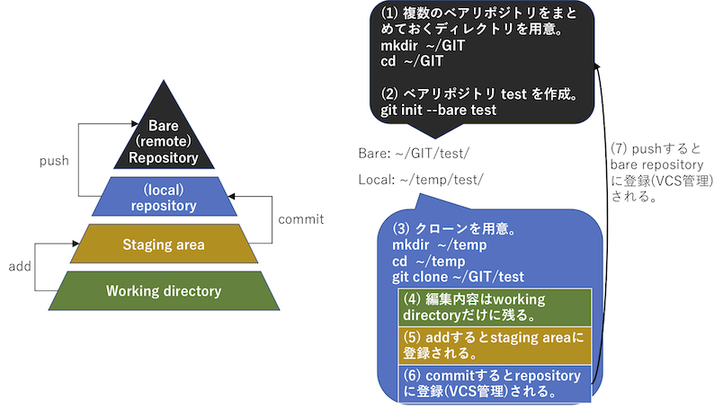

# Gitによるバージョン管理入門

## バージョン管理とは
- 文字通り「バージョン（版）」を管理する。詳細は後述。
- **バージョン管理なし** で良くある状況。
  - 一人で作業してても、
    - プログラムにかぎらず文書作成中に複数のバージョンができる。
    - 作業に集中してる時ならともかく、後で振り返るとどのファイルが何をしたものか判別つかない。（e.g., 先週やった内容どれだけ覚えてる？）
  - 複数人で作業してると、
    - 作業したファイルをLINEなりファイル添付できるサービスで送る。
      - 作業毎（≒ファイル毎）に最新版を作業者がフォルダ管理してて、メンバ全体では共有しきれていない。
      - 必要な時に必要なだけリクエストする（過去は見ない）。応答してもらえないと詰む。応答してもらっても詰む。
        - 「あ、それ古いやつだった。送り直すわ」「ごめん、新しく編集しなおしたからry」
      - 最終バージョンがどれか分からない。
      - 前に作った内容に戻したいが見つからない。
- **バージョン管理における「管理」の対象は、コンピュータ上で作成されるファイルの変更履歴（いつ、誰が、何を変更したか）**。バージョン管理を支援するシステムの総称がバージョン管理システム。
  - システムの管理方法の違いにより「集中管理方式」と「分散管理方式」に大別され、Gitは分散管理方式の一例。

---
## 主な用語
- **リポジトリ (repository)**
  - バージョン管理してるファイルやディレクトリの状態を記録する場所。一種のデータベース。
  - 分散管理方式の場合、このリポジトリにいくつかの種別があり、例えば「サーバにおいてある共用のリモート・リポジトリ」と、「個々人がPCで作業するためのローカル・リポジトリ」のように呼び分けることがある。
    - 大元となるリポジトリのことを **ベア・リポジトリ** と呼ぶ。
- **クローン (clone; git clone)**
  - ベアリポジトリから複製したローカル・リポジトリのこと。リポジトリを複製することを「クローンを作る」と呼ぶ。
  - 通常、ベア・リポジトリにて直接作業をすることはせず、複製して用意したローカル・リポジトリにて作業を行い、適度なタイミングでリモートに更新履歴を通知する形で利用する。
- **追加 (add; git add)**
  - 作業内容をステージング・エリアに送るコマンド。
- **ステージング・エリア or インデックス (staging area, index)**
  - 作業内容をリポジトリに記録するための **手前のエリア** 。
  - 後述のコミットはリポジトリに記録すること。この時に必要となる「リポジトリに記録する内容」を前もって準備するのがステージング・エリア。
  - 一般的な作業の流れ
    - (1) ローカル・リポジトリで作業。
    - (2) ステージング・エリアに記録 (git add)。
    - (3) リポジトリに記録 (git commit)。
  - ステージング・エリアがあることで、嬉しいことの例。
    - 作業ディレクトリにはリポジトリに記録したくないゴミも溢れている。（変更通知したいファイルだけをステージング・エリアに記録するための中間地点として使える）
- **コミット (commit; git commit)**
  - ファイルやディレクトリの変更履歴をリポジトリに記録すること。
  - コミットしなかったものはリポジトリとして管理されない点に注意。（何でも自動でやってくれるわけではない）
- **コミット・メッセージ (commit message)**
  - コミット時のコメント文のこと。何を修正したのかを端的に伝える文章であることが望ましい。
- 概要図: リポジトリによるバージョン管理のイメージ
  -  
  - [図拡大版](https://ie.u-ryukyu.ac.jp/~tnal/2021/prog1/static/figs/git.pdf)

---
## GitとGitHub、GitLabの関係
- Git: バージョン管理システム
- GitHub: Gitで管理するリポジトリを共有するためのWebサービス。チケットやwiki等、チーム作業する際に便利な機能をまとめて提供している。
  - 無料で使える機能で事足りることが多いため、チームとは無関係に個人作業で利用している人も多い。
  - まだ少数にとどまるが、就職活動や何かのプロジェクト公募において、応募者のスキルを確認するために「GitHubのアカウントは？」と聞かれることもある。
- GitLab: GitHubクローン。GitHubは固有のWebサービスだが、ソースを公開している。その名前がGitLab。このソースを使って独自サービスを立てたものをそのままGitLabと呼ぶことが多い。
  - 知能情報コースでも[gitlab](https://gitlab.ie.u-ryukyu.ac.jp/)がサービスとして立ち上がっている。利用にはieアカウントが必要。利用は自由にどうぞ。

---
## チュートリアル
### 達成目標
- 今回は共有を考えず、PC内だけで完結。
  - 共有する際にはベア・リポジトリ（共有リポジトリ）を共有サービスに用意する。
- git利用前の設定をする。
- ベア・リポジトリと作業用ディレクトリを区別して利用する。
  - ベア・リポジトリを準備し、実際に作業する際には作業用ディレクトリを複製用意してから作業する。
- 古いバージョンに戻る。

---
### step 0. gitがインストールされてるかの確認
- ターミナル上で ``git --version`` と入力して実行。
  - Command Not Found と言われるならインストールされてない可能性あり。
    - ``brew install git`` でインストール。
  - git version 2.24.2 (Apple Git-127) とかgitのバージョン情報が出力されるならok。

---
### step 1. Git利用前の設定。
下記設定1,2は「誰が変更したか」を記録するためのもの。設定3はコマンドのエイリアス（省略設定）。エイリアスにより例えば ``git status`` と実行する代わりに ``git st`` で済ますことができる。

- 設定1：名前の設定。
  - ``git config --global user.name "Naruaki TOMA"``
    - **自分の名前に修正して実行すること。**
- 設定2：メールアドレスの設定。
  - ``git config --global user.email "tnal@ie.u-ryukyu.ac.jp"``
    - **自分のメールアドレスに修正して実行すること。**
- 設定3：gitコマンド利用時のエイリアスの設定。
  - エディタで ``~/.gitconfig`` を開き、以下の設定を最下部にコピペして保存。
```
[alias]
        co = checkout
        st = status
        br = branch
        ci = commit
```

---
### step 2. ベア・リポジトリとそれを集約する場所の用意。
- まず、リポジトリを保存しておくためのディレクトリを用意。以下では ~/GIT を作成している。散らばると探せなくなるので、ベア・リポジトリは全てここに用意することとする。
  - ``mkdir ~/GIT``
- 今回のチュートリアル用リポジトリ test を作成。
  - 手順としては、(a)先ほど作成した ~/GIT に移動し、(b)そこにtestという名前のベア・リポジトリを作成。
  - git init はリポジトリを用意する時に一度だけ実行する。今後はこのリポジトリを複製して利用することになる。
```shell
cd ~/GIT
git init --bare test
```

---
### step 3. 作業用ディレクトリの用意。
- ベア・リポジトリ（~/GIT/test）で直接作業することがあってはならない。作業する際には作業用ディレクトリを作成し、そこで行う。今回は ~/temp/test に作業用ディレクトリを作成しよう。
  - 作業用ディレクトリを複製用意するには``git clone リポジトリ``する。引数でリポジトリを指定すること。
  - 「作業用ディレクトリ」は、文字通り作業するための場所。記録は全て「ベアリポジトリ」に残る。作業用ディレクトリは、作業を終えたら削除してしまっても構わない（ベアリポジトリから復元できる）。
```shell
mkdir ~/temp
cd ~/temp
git clone ~/GIT/test
cd test
```

---
### step 4. 初めてのバージョン管理。
#### step 4.1 作業用ディレクトリで作業。
- 今回は、test1.txt と test2.txt という2つのファイルを作成してみよう。
  - 好みのエディタでファイルを新規作成し、作業用ディレクトリに保存しよう。
  - test1.txt には「これは必要」と書いて保存。
  - test2.txt には「このファイルは不要」と書いて保存。

---
#### step 4.2 git管理状況の確認。
- ``git status``（エイリアス設定しているなら ``git st``）で、ワーキングツリー内にあるファイル集合に対して、git管理下にあるか否か、ステージング・エリアにあるか否かといった「状態」を確認することができる。
- test1.txt, test2.txt を作成した時点では、両方共「Untracked files（gitが追跡していないファイル）」にリストアップされているはずだ。

---
#### step 4.3 ステージング・エリアに記録（作業結果のうちリポジトリに記録するファイルの選別）。
- ステージング・エリアに記録するには``git add ファイル名``とする。引数でファイル名を指定すると、それらをステージング・エリアに記録する。
  - ファイル名は複数列挙も可能。列挙する際には「ファイル名1 ファイル名2」のように半角スペースで区切って列挙。
  - git add を複数回に分けて実行しても良い。（設定上書きではなく、追加記録になる）
- 今回は test1.txt のみをステージング・エリアに記録したい。この場合``git add test1.txt``と実行する。
  - addした後で、もう一度statusを確認してみよう。ステージング・エリアに移動したファイルが「Changes to be committed（コミットされる更新）」に移動してるはずだ。

```{tip}
- Q: 間違って add した場合、これを削除するにはどうしたら良いだろうか？（調べてみよう）
```

---
#### step 4.4 問題なければリポジトリに記録。
- ステージング・エリアに記録したファイルをリポジトリに記録するには``git commit``もしくは``git commit -m "This is first trial."``のように実行する。（好みの方を使って下さい）
  - git commit と実行すると、環境変数EDITORで指定したエディタ（標準ではvim）が起動し、コミット・メッセージを記入する状態になる。この場合、メッセージを書いてエディタを終了すると、commitが始まる。（メッセージを書いて終了しないと、commitされない）
  - git commit -m "ほげ" という形式では、エディタを開かずに、ターミナルでメッセージを指定して即記録することが可能。
  - コミット文例: [gitにおけるコミットログ/メッセージ例文集100](http://anond.hatelabo.jp/20160725092419)

```{tip}
- Q: 間違って commit した場合、これを削除するにはどうしたら良いだろうか？（調べてみよう）
```

---
#### step 4.5 問題なければベア・リポジトリに記録。
- commitした時点では、更新内容をローカル・リポジトリに記録しているだけ。正式にベア・リポジトリにも記録するにはもう一つ実行する必要がある。
  - ``git push``

---
#### step 4.6 作業追加してみる。
- 手順4.1〜4.5を繰り返し、バージョン更新してみよう。
  - 最初の手順4.1時には新規にファイルを作成した。今回は既に存在する test1.txt を更新する形で作業しよう。更新したことが分かるなら何でも良いが、例えば2行目に「追加」と記入しておこう。
  - 更新内容例
    - test1.txtの2行目に「追加」と記入。

---
### step 5. バージョンを行き来してみる。
#### step 5.1 更新履歴（概要）を確認してみる。
- 更新履歴を確認するには``git log``する。
  - 出力される項目一覧
    - commit: ユニークなコミットID（コミット内容の SHA-1 チェックサム）
    - Author: 更新者
    - Date: 更新日
    - テキスト: コミット・メッセージ
  - Dateを眺めるとわかるが、最新のコミットが先に出力され、順に古いコミットが出力される。一番最後に出力されるのは、初めてコミットしたもの。

---
#### step 5.2 どこが変わったか確認してみる。
- git log には多数のオプションがある。便利な機能の例として、``git log -p -1``とすると、「直近1回の更新で行われた変更点」を確認することができる。（diffコマンドと同機能）

---
#### step 5.3 古いバージョンに戻ってみる。
- gitにおけるバージョンは「1」等のint型数字ではなく、5.1説で述べたように「SHA-1チェックサム」で生成された文字列である。バージョンを指定するにはこの文字列を指定することになる。
- チェックサムを確認するために、git logを実行。古いコミットのチェックサムをコピーしよう。
- チェックサムをコピーしたら、``git checkout チェックサム``として実行。
  - checkout = ブランチをスイッチするか、ワーキングツリーを復元する。今回は後者の復元を使用した例。
  - 指定したチェックサムに戻ると、、
    - 2回目の更新が消えているはず。(test1.txtの中身はどうなってる？ git log で出力される更新履歴はどうなってる？)

---
#### step 5.4 新しいバージョンに戻ってみる。
- 古いバージョンにいる時、git logをしても「そこまでの履歴」しか表示されない。
- git管理下にある全ての更新履歴を表示するには``git log --all``しよう。この出力のうち戻りたいバージョンのチェックサムをコピーし、改めてgit checkoutするとその版に戻れる。
  - 戻れたかどうか確認してみよう。(test1.txtの中身はどうなってる？ git log で出力される更新履歴はどうなってる？)

---
### step 6. 本当にベア・リポジトリに記録されているかを確認してみる。
- 忘れずに最終更新を push しているならば、更新履歴はベア・リポジトリにも記録されているはずだ。
- （怖いかもしれないけど）作業用ディレクトリを削除し、改めてクローンを作成してみよう。
  - うまくいけば、新しくクローンしたtestディレクトリの中身が、先ほどの最終更新時点のものと一緒であることが確認できるはずだ。
    - test2.txt をadd, commit, push していない場合には、test2.txt が失われているはず。これはリポジトリに記録しなかったため。
```shell
cd ..
rm -rf test
git clone ~/GIT/test
cd test
```

---
### よく使うコマンド一覧（振り返り）
```shell
git init --bare <directory_name>
git clone <repository>
git add <file_name>
git commit -m "messages"
git push
git log
git status
git checkout <revision_checksum>
```
- git clone 時にGitHub上で公開されてるリポジトリのURLを指定すると、そのクローンを作成できる。
- その他よく使うコマンド
  - ``git branch``: ブランチ＝枝。派生や一時的な作業場所。使用例：プロジェクト本体で直接作業するのではなく、枝分けして本体への影響がない場所で作業し、目処が立ったら本体に合流する。
  - ``git merge``: 合併。複数人で作業してると「Aさんがコミットしたことを知らぬ間に、Bさんが古いバージョンを元にしたコミットをしようとする」といったコミットの**衝突**（どちらが正しいコミットか機械的な判断ができない問題）が起こる。衝突が起きた際にそれを人手で解消し、解消したことを伝える（＝合併終了の通知）コマンドがマージ。

---
## 参考サイト
- [「すごいGit楽しく学ぼう」を公開しました](http://alpha.mixi.co.jp/entry/20150513) by 情報工卒業生
- Git-it: [Git-it (Desktop App)](https://github.com/jlord/git-it-electron)
- [Git の基本 - コミット履歴の閲覧](https://git-scm.com/book/ja/v1/Git-の基本-コミット履歴の閲覧)
- [サルでもわかるGit入門 〜バージョン管理を使いこなそう〜](http://www.backlog.jp/git-guide/)
- [知らないと現場で困るバージョン管理システムの基礎知識](http://www.atmarkit.co.jp/ait/articles/1305/20/news015.html)
- [git pull と git pull –rebase の違いって？図を交えて説明します！](http://kray.jp/blog/git-pull-rebase/)
- [バージョン管理システム](https://ja.wikipedia.org/wiki/バージョン管理システム) by Wikipedia
- [gitにおけるコミットログ/メッセージ例文集100](http://anond.hatelabo.jp/20160725092419)
- [学科提供gitlab](https://gitlab.ie.u-ryukyu.ac.jp/)
