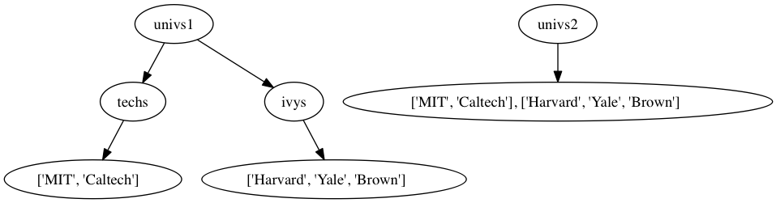

# シーケンス集合（str, list, tuple）

## 達成目標
- シーケンス集合の要素数を数え、インデックスやスライスで要素参照できる。
- リストに対して代表的な操作（要素追加・検索）を実行でき、必要に応じて調べて他操作を実行できる。
- 多重リストに対する操作時に注意が必要な点を理解する。

```{note}
str, list, tupleに関するすべての操作を覚えておく必要はない。「こういうデータ型あったよな。こういう操作するにはどうしたら良かったっけ」のように、必要なときに調べて使えるようになろう。シーケンス集合に限らずプログラミングにおいては **APIドキュメント等を調べて使う** ことが多い。これはプログラミング言語の仕様が多岐にわたるが、必ずしも全ての機能を利用するわけではないためである。調べる力を磨こう。

一方、どのようなプログラムにおいても共通して使うことが多い操作もある。それが上記目標で掲げた **要素数カウント、インデックスやスライスによる参照、リストへの追加・検索** だ。
```

```{tip}
[str型オブジェクト](https://docs.python.org/ja/3.8/library/stdtypes.html#str)については参照だけをみていく。より細かな操作については後日扱う。
```

---
## インデックスの利用
### インデックス参照
これまでに何度も利用しているstr型オブジェクトは、順序の付いたシーケンスの例である。``'abc'`` は、最初に ``'a'``、その次に ``'b'``、最後に ``'c'``と並んでいる文字列であり、この順番が入れ替わってしまうと異なる文字列になるため順序が重要だ。このように順序の付いた要素集合をシーケンスと呼ぶ。

```{note}
順序のない要素集合のことは単に集合と呼び、Pythonでは[set型オブジェクト](https://docs.python.org/ja/3.8/library/stdtypes.html#set-types-set-frozenset)が提供されている。
```

これまでに出てきたシーケンスはlist型とstr型の2種類であり、どちらもインデックスを使って「指定した順番に保存している要素」へアクセスすることができる。例を眺めてみよう。
```python
# list型オブジェクトに対する個別要素の参照例
>>> data = [10, 20, 30, 40]
>>> len(data)
4
>>> data[0]
10
>>> data[3]
40

# str型オブジェクトに対する個別要素の参照例
>>> len('abc')
3
>>> 'abc'[0]
'a'
>>> 'abc'[1]
'b'
>>> 'abc'[2]
'c'
>>> enemy = 'naltoma'
>>> enemy[0]
'n'
```

[len関数](https://docs.python.org/ja/3.8/library/functions.html?highlight=len#len)は引数で指定されたオブジェクトの長さ（要素数）を返す。‘‘data[0]’’, ``'abc'[0]``, ``enemy[0]`` は、全て **0番目の要素を参照** する例である。順番を指定して要素を参照するには ``変数名[index]`` か ``オブジェクトそのもの[index]`` という書式で記述する。

---
### インデックス参照補足、スライス処理


インデックスを指定する際、Python特有の書式が2つある。

1つ目は **後ろから数える** という指定方法であり、``[-1]`` と指定すると「後ろから1番目」という意味になる。頭は0番目から数えるが、後ろから逆順に遡りたい場合には「-1番目、-2番目、-3番目、、、」のように指定できる。

````{note}
これに対して **len関数を用いることで要素数を確認することができるため、この値を利用してインデックス指定することも可能** だ。例えば ``len('abc')`` で 3 が得られる。このとき、一番最後の要素は0番目から数えると2番目にある。この2番目というインデックスは「要素数 – 1」であることから、次のようにして最後尾の要素を参照することができる。（**他の言語ではこのような考え方で参照することが多い**）
```python
data = 'naltoma'
last = data[len(data) – 1]
print(last)
```
````

2つ目のPythonb特有記述は **スライス(slicing)** と呼ばれており、**x番目からy番目までというように連続した複数要素を切り出したい** ときに使う記述方法が提供されている。前述のように変数dataにシーケンスが保存されているとすると、 ``data[始まるインデックス:終わりインデックス]`` という形式で指定する。この際、始まるインデックスのデフォルト値（省略した際の値）は0であり、終わりインデックスのデフォルト値は ``len(data)`` である。このため、 ``data[:2]`` は「冒頭から2番目まで」を指定しており、``'na'`` が得られる。``data[1:]`` は「1番目から最後まで」であり、``'altoma'`` が得られる。確認してみよう。

---
## mutable vs immutable
str型オブジェクトとリスト型オブジェクトを例にインデックス参照やスライスを眺めてきたように、要素を参照するだけであればどちらも共通した操作が可能である。一方、str型オブジェクトは要素を変更（immutable）をすることができないのに対し、list型オブジェクトは要素変更が可能（mutable）だ。コード例で確認してみよう。

```python
# リストで要素を変更する例
scores = [40, 70, 100, 0]
print(len(scores)) # => 4
print(scores[0])   # => 40
print(scores[0:2]) # => [40, 70]

#scoresの0番目を上書きする。
scores[0] = 50
print(scores[0])   # => 50
print(scores)      # => [50, 70, 100, 0]
```

上記コード例ではscoresに保存されているシーケンスの0番目を変更している様子を示している。同様のことをstr型オブジェクトに対して実行しようとすると、エラーになる。（確認してみよう）

````{note}
このように、Pythonでは値を変更できる「mutable（変更可能）」、変更できない「immutable（変更不可）」という属性が型に付与されている。これまでに出てきた int, float, str, list の中では str型だけが変更できない。それ以外は変更可能である。なお、**ここでいう変更できないというのは「一部の要素を変更することができない」といっているだけ** だ。例えば、以下のコードは「全体を変更している」ため、エラーにはならない。
```python
data = 'naltoma'
data = 'hoge'
```
````

`````{admonition} 検討
strオブジェクトへの変更が可能かどうかを確認してみよう。
````{dropdown} 検討例
```python
# strオブジェクトで一部を変更しようとしても、出来ないことの確認。
>>> name = 'naltoma'
>>> name[0]
'n'
>>> name[0] = 'b'
Traceback (most recent call last):
  File "<stdin>", line 1, in <module>
TypeError: 'str' object does not support item assignment

# 変数を新しく assign (紐付け) し直すことは可能。
>>> name = 'hoge'
>>> print(name)
hoge
```
````
`````

---
## リスト操作
### リストオブジェクトの作成
**リスト型オブジェクト(list)** の各要素は任意の型オブジェクトを取りうる。リスト内の各オブジェクトはindexにより紐付けられる。リストを作るには、大別して次の2通りの手続きで行う。
- 方法1: リストとして作成したいオブジェクトをカンマ ``,`` で列挙し、``[``〜``]``で囲う。
  - 事前に全要素がわかっているならこちらを使うことが多い。
- 方法2: 空のリスト ``[]`` を代入した変数を予め用意しておき、そのリストに追加・削除する形でリストを用意(更新)する。
  - 例えば「80点以上の学生一覧を作る」場合は、事前に一覧を用意するのではなく点数を確認しながら一覧に追加していくという処理になるだろう。このように処理途中で追加もしくは削除していく場合にはこちらを使うことが多い。

```python
# リストの作成例(1): 最初から必要なオブジェクトを列挙して用意する。
# 教科書 p.58 のコード例を少し修正
>>> list_ex = ['I did it all', 4, 'love']
>>> len(list_ex)
3
>>> print(list_ex[0])
I did it all
>>> print(list_ex[-1])
love
>>> print(list_ex)
['I did it all', 4, 'love']
>>> for i in range(len(list_ex)):
...     print(list_ex[i])
...
I did it all
4
love
>>> for i in list_ex:
...     print(i)
...
I did it all
4
love
# リストの一部分（ここではlist_ex[0]）を変更してみる
>>> list_ex[0] = 3
>>> print(list_ex[0])
3
>>> print(list_ex)
[3, 4, 'love']
```

```python
# リストの作成例(2): 空のリストに、オブジェクトを追加する。
>>> list_ex2 = []
>>> len(list_ex2)
0
>>> list_ex2.append(1)
>>> len(list_ex2)
1
>>> print(list_ex2)
[1]
>>> list_ex2.append('hoge')
>>> len(list_ex2)
2
>>> print(list_ex2)
[1, 'hoge']
```

---
### リスト操作（教科書図5.4＋α）
今すぐ全ての操作方法を覚える必要はない。頻出する ``+``, ``append``, ``in演算子による検索`` は覚えておき、それ以外は必要に応じて調べて利用できるようになろう。

- リスト同士の結合（+演算子）
```
>>> list_ex3 = [1, 2, 3]
>>> list_ex4 = [4, 5, 6]
>>> list_ex5 = list_ex3 + list_ex4
>>> print(list_ex5)
[1, 2, 3, 4, 5, 6]
```
- list.append(object): listの後ろにobjectを追加。
```
>>> list_ex3 = [1, 2, 3]
>>> list_ex3.append(1)
>>> print(list_ex3)
[1, 2, 3, 1]
```
- in演算子によるリスト要素の検索
```
>>> 3 in list_ex3
True
>>> 10 in list_ex3
False
```
- list.count(object): list内にobjectがある個数を返す。
```
>>> list_ex3.count(1)
2
```
- list.insert(i, object): listのi番目にobjectを追加する。
```
>>> list_ex3.insert(0, 'hoge')
>>> print(list_ex3)
['hoge', 1, 2, 3, 1]
```
- list.extend(other_list): listの後ろに、別のリストother_listを追加する。
```
>>> list_ex3.extend(list_ex4)
>>> print(list_ex3)
['hoge', 1, 2, 3, 1, 4, 5, 6]
```
- list.remove(object): listの頭から探していき、初めに見つかったobjectを削除 する。
```
>>> list_ex3.remove(1)
>>> print(list_ex3)
['hoge', 2, 3, 1, 4, 5, 6]
```
- list.index(object): listの頭から探していき、初めに見つかったobjectのインデックスを返す。もし見つからなければErrorを返す。
```
>>> list_ex3.index(1)
3
```
- list.pop(index): list[index]の値を削除しつつ、返す。
```
>>> list_ex3.pop(0)
'hoge'
>>> print(list_ex3)
[2, 3, 1, 4, 5, 6]
```
- list.sort(): listを小さい順 (ascending order) に並べ直す。
```
>>> list_ex3.sort()
>>> print(list_ex3)
[1, 2, 3, 4, 5, 6]
```
- list.reverse(): listを逆順に並べ直す。
```
>>> list_ex3.reverse()
>>> print(list_ex3)
[6, 5, 4, 3, 2, 1]
```

`````{admonition} 検討
課題レポートに対する採点結果の一覧として ``scores = [100, 90, None, 100]`` が用意されたとしよう。ここで ``None`` はstr型ではなく[NoneType型](https://docs.python.org/ja/3.8/library/constants.html)の値であり、レポートが未提出のためまだ採点結果がないことを意味しているとする。

- 検討1: scoresにはまだ4名分の採点結果しか登録されていない。5人目の採点結果として ``60`` を追加する操作を検討せよ。
- 検討2: 未提出者が存在するかどうかを判断する操作を検討せよ。
````{dropdown} 回答例
```python
scores.append(60)
print(None in scores)

# in演算子を使ったコード例
if None in scores:
    print('未提出者がいました')
else:
    print('未提出者はいません')
```
````
`````

---
### リスト操作時の注意点
教科書 5.3.1節 cloning の補足。
```{warning}
for文で反復処理をするオブジェクトとしてリストを指定している最中に、そのリスト自身に変更を加えると動作がおかしくなる。

- 何故か？
  - for文はリストの全要素に対して反復処理する際に、インデックスを内部で参照しているため。
- 対処法
  - (a) 反復処理対象のシーケンスとして該当リストを指定しない。
  - (b) 反復処理前にリストを複製し、反復対象のリストと、編集用のリストを分けて利用する。
```

問題のあるケースを眺めていこう。下記コードは第1引数list1をもとに、第2引数list2と重複している要素は除外（``list1.remove(e1)``）するつもりで書いたコードである。

```python
def remove_dups(list1, list2):
    for e1 in list1:
        if e1 in list2:
            list1.remove(e1)

l1 = [1, 2, 3, 4]
l2 = [1, 2, 5, 6]
remove_dups(l1, l2)
print(l1)
# -> 想定では[3,4]になって欲しいが、実際には[2, 3, 4]になってしまう。
# 何故こうなるのかはデバッガで確認してみよう。
```

- 事前にリストを複製してから反復処理する例
  - 下記コード中の``list1[:]``は、「list1の最初から最後まで」を省略した書き方。
  - 教科書にある通り``for e1 in list1[:]:``に変更するだけでもOK。

```
def remove_dups(list1, list2):
    duplicate = list1[:]
    for e1 in list1:
        if e1 in list2:
            duplicate.remove(e1)
    return duplicate

l1 = [1, 2, 3, 4]
l2 = [1, 2, 5, 6]
result = remove_dups(l1, l2)
print(result)
print(l1)
```

---
## リスト参照を含むリスト（図5.1〜5.3）
リストには任意のオブジェクトを含めることができるため、「リストの要素としてリストを含める」ことも可能だ。このようにリスト参照を含むリストのことを多重リストと呼ぶ。教科書の図5.1〜5.3は「リストが別のリストを参照している」場合に、片方のリストへの操作が別リストにも影響を及ぼすことを可視化している例でる。



```python
# 2つのリスト techs, ivys を用意。
>>> techs = ['MIT', 'Caltech']
>>> ivys = ['Harvard', 'Yale', 'Brown']
# 別のリスト univs1, univs2 を用意。
# univs1 は、リスト techs と ivys を要素とする。
# univs2 は、既存変数とは無関係に新しくstr型オブジェクトを列挙したリストを要素とする。

>>> univs1 = [techs, ivys]
>>> univs2 = [['MIT', 'Caltech'], ['Harvard', 'Yale', 'Brown']]
>>> univs1 == univs2
True
# 上記補足:
# 　リスト同士の``==``は、「順番通りに保持している値が等しいか」だけを判定。
# 　メモリ空間上は異なる部分を参照していても、保持している値が等しければ True になる。

>>> id(univs1) == id(univs2)
Flase
# 上記補足:
# 　関数idは、指定されたオブジェクトのユニークなID（≒住所）を返す。
# 　同一オブジェクトを指すなら、IDが等しくなる。
# 　異なるオブジェクトを指すなら、IDが異なる。
# 　=> 値として等しいか、オブジェクトとして等しいかとで使い分ける必要がある。

>>> print(univs1)
[['MIT', 'Caltech'], ['Harvard', 'Yale', 'Brown']]
>>> print(univs2)
[['MIT', 'Caltech'], ['Harvard', 'Yale', 'Brown']]

# 上記の状態から、
# techs を編集（下記では techs[0] を違う値に変更）すると、
# techsリストを参照している univs1 にも影響が及ぶ。
>>> techs[0] = 'hoge'
>>> print(techs)
['hoge', 'Caltech']
>>> print(univs1)
[['hoge', 'Caltech'], ['Harvard', 'Yale', 'Brown']]
>>> print(univs2)
[['MIT', 'Caltech'], ['Harvard', 'Yale', 'Brown']]

# 上記の状態から、
# techs を編集（ここではtechsの後ろに新しいオブジェクトを追加）すると、
# techsリストを参照している univs1 にも影響が及ぶ。
>>> techs.append('RPI')
>>> techs
['hoge', 'Caltech', 'RPI']
>>> univs1
[['hoge', 'Caltech', 'RPI'], ['Harvard', 'Yale', 'Brown']]
>>> univs2
[['MIT', 'Caltech'], ['Harvard', 'Yale', 'Brown']]
```

---
### リスト内包表記
演算結果をリストとして保存したい場合、リストの中に演算を書くことができる。具体例を眺めてみよう。下記コードの case 1 は通常のfor文での例であり、これをリスト内包表記で記述したものが case 2 だ。

- (case 1) 通常のfor文で計算する書き方。
```python
squares = []
for x in range(1,7):
    squares.append(x**2)

print(squares)
# -> [1, 4, 9, 16, 25, 36]
```

- (case 2) リスト内包表記での書き方。
```python
squares = [x**2 for x in range(1,7)]
print(squares)
# -> [1, 4, 9, 16, 25, 36]
```

リスト内包表記を書くことはできなくても構わないが、書かれているコードを読めるようになろう。

---
### リスト参考サイト
- [チュートリアル, リスト型 (list)](http://docs.python.jp/3/tutorial/introduction.html#lists)
- [チュートリアル, リストの内包表記](http://docs.python.jp/3/tutorial/datastructures.html#list-comprehensions)

---
## タプル操作
リストに似たものに **タプル（tuple）型オブジェクト** がある。書式上の違いはリストが ``[]`` で囲うのに対し、タプルは ``()`` を用いるだけである。しかしタプルは immutable であり、後から要素を追加・削除するといった要素変更はできない点が大きく異なる。要素変更できないだけの違いならばリストの劣化版でしかないが、処理速度が早いというメリットがある。これは、リストがメモリ上のどこに保存されているかを確認しながら辿るのに対し、タプルはメモリ上に連続したスペースを確保して利用する（だから変更できない）ためである。

```python
# リストの例
>>> data1 = [10, 20, 30]
>>> data1[0]
10

# タプルの例
>>> data2 = (10, 20, 30)
>>> data2[0]
10
>>> data2[0] = 500   #上書きしようとした
Traceback (most recent call last):
  File "<stdin>", line 1, in <module>
TypeError: 'tuple' object does not support item assignment
```

```{note}
本授業では直接的にタプルを操作することは殆どないが、関数の戻り値では自動的にタプルで返されていること、操作が早いため大規模データに対する処理等に向いていることを覚えておこう。
```

```{tip}
Excelのような2次元セル空間を想像してみよう。リストを用いると各要素は空間内に散らばる形で保存されている。これに対しタプルは連続したセルとして保存されている。このようなデータ構造の差異と特徴については2年次の講義[アルゴリズムとデータ構造](https://tiglon.jim.u-ryukyu.ac.jp/portal/Public/Syllabus/DetailMain.aspx?lct_year=2020&lct_cd=617005001&je_cd=1)で習います。
```

---
## 復習・予習
- 復習
  - 適宜過去資料及び教科書を参照しよう。
- 予習
  - 5.6 Dictionaries
